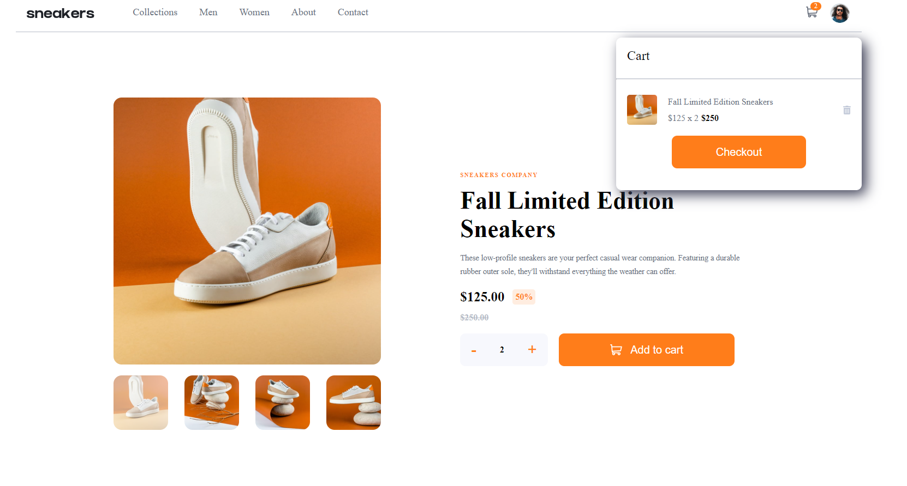
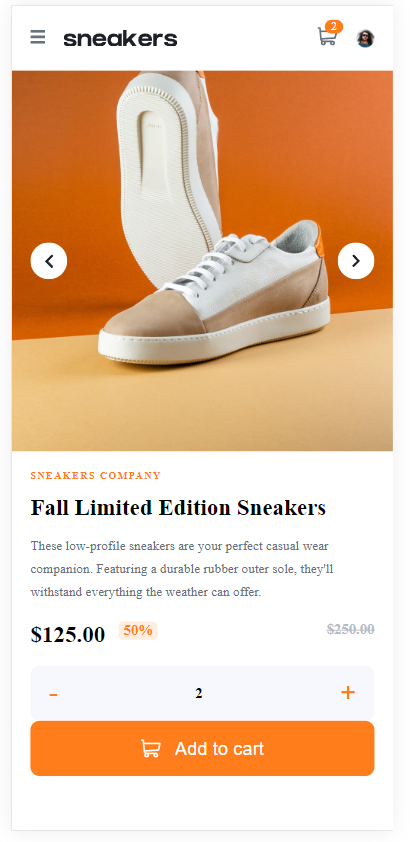

# E-commerce Product Page

> An e-commerce application enabling browsing, selection, and purchase of products through an interactive image gallery, adding products to the cart, managing the cart content, and providing a responsive layout that adapts to various devices.
> Live demo [_here_](https://www.example.com).

## Table of Contents

- [General Information](#general-information)
- [Technologies Used](#technologies-used)
- [Features](#features)
- [Screenshots](#screenshots)
- [Setup](#setup)

## General Information

- The project aims to enhance front-end skills and create interactive e-commerce websites.
- The main goal is to facilitate easy product browsing and convenient online shopping.
- The project enables practice in web design skills.

## Technologies Used

-  React (z React DOM) - wersja 18.2.0
-  TypeScript - wersja 5.0.2
- 
  Sass - wersja 1.69.5
- Eslint - wersja 8.45.0
-  Testing Library (np. @testing-library/react) - wersja 14.1.2
-  Vite - wersja 4.4.5

## Features

- Browsing products in an intuitive gallery.
- Ability to enlarge product images by interacting with thumbnails.
- Adding selected products to the shopping cart.
- Managing the cart's content by browsing and removing items.
- Responsive layout adapting to various device screen sizes.
- User interactions through hover effects on interactive elements.

## Screenshots

#### Desktop



#### Mobile



## Setup

### Project Dependencies

Dependencies and their versions are defined in the package.json file:

```json
{
  "name": "ecommerce-product-card",
  "private": true,
  "version": "0.0.0",
  "type": "module",
  "scripts": {
    "dev": "vite",
    "host": "vite --host",
    "build": "tsc && vite build",
    "lint": "eslint . --ext ts,tsx --report-unused-disable-directives --max-warnings 0",
    "preview": "vite preview",
    "test": "vitest"
  },
  "dependencies": {
    "framer-motion": "^10.16.4",
    "react": "^18.2.0",
    "react-dom": "^18.2.0",
    "sass": "^1.69.5",
    "uuidv4": "^6.2.13"
  },
  "devDependencies": {
    "@testing-library/dom": "^9.3.3",
    "@testing-library/jest-dom": "^6.1.4",
    "@testing-library/react": "^14.1.2",
    "@testing-library/user-event": "^14.5.1",
    "@types/react": "^18.2.15",
    "@types/react-dom": "^18.2.7",
    "@typescript-eslint/eslint-plugin": "^6.0.0",
    "@typescript-eslint/parser": "^6.0.0",
    "@vitejs/plugin-react": "^4.0.3",
    "@vitest/browser": "^0.34.6",
    "eslint": "^8.45.0",
    "eslint-plugin-react-hooks": "^4.6.0",
    "eslint-plugin-react-refresh": "^0.4.3",
    "jsdom": "^22.1.0",
    "typescript": "^5.0.2",
    "vite": "^4.4.5",
    "vite-plugin-svgr": "^4.1.0",
    "vitest": "^0.34.6",
    "webdriverio": "^8.24.3"
  }
}
```

## Local Installation and Running

1. **Cloning the Source Code**
   Clone the repository containing the source code:

```bash
   git clone https://github.com/twoje-repozytorium.git
```

2. **Installing Dependencies**
   Navigate to the project directory and install dependencies:

```bash
cd nazwa_folderu_projektu
npm install  # lub yarn install, jeśli używasz Yarn
```

3. **Running the Project**
   After installing dependencies, start the application:

```bash
npm run dev  # lub yarn run dev, jeśli używasz Yarn
```

This will run the application in development mode. Open a web browser and go to http://localhost:5173/ to see the application in action.
